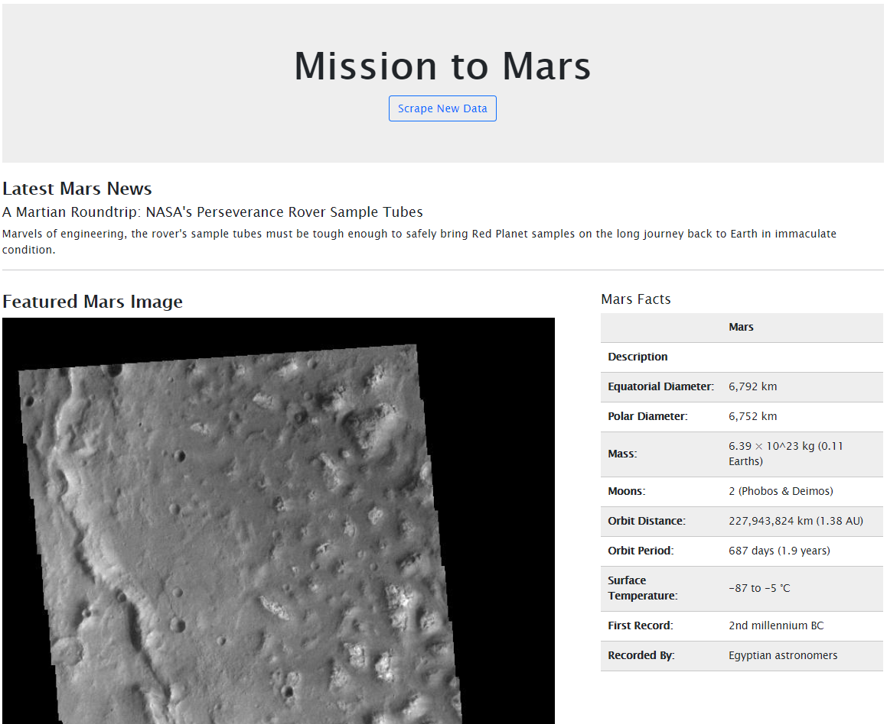
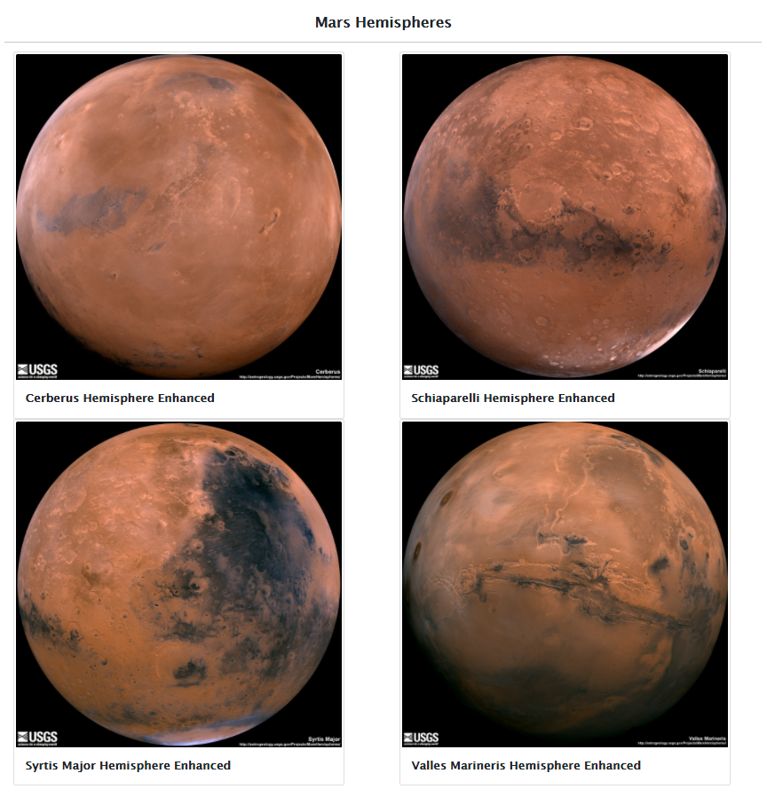

# Web Scraping Challenge

This repository is to build a web application that scrapes various websites for data related to the Mission to Mars and displays the information in a single HTML page.

## Step 1 - Scraping

* The initial scraping was completed using Jupyter Notebook, BeautifulSoup, Pandas, and Requests/Splinter.

* A Jupyter Notebook file called `mission_to_mars.ipynb` was created and this was used to complete all of the scraping and analysis tasks. The data scraped was the following:

* Splinter was used to navigate the sites when needed and BeautifulSoup was used to help find and parse out the necessary data.

### NASA Mars News

* Scraped the [NASA Mars News Site](https://mars.nasa.gov/news/) and collect the latest News Title and Paragraph Text. 
* Assigned the text to variables so that they can be referenced later.

### JPL Mars Space Images - Featured Image

* Visited the url for JPL Featured Space Image [here](https://www.jpl.nasa.gov/spaceimages/?search=&category=Mars).

* Used splinter to navigate the site and find the image url for the current Featured Mars Image and assigned the url string to a variable called `featured_image_url`.

* Found the image url to the full size `.jpg` image.

* Saved a complete url string for this image.

### Mars Facts

* Visited the Mars Facts webpage [here](https://space-facts.com/mars/) and used Pandas to scrape the table containing facts about the planet including Diameter, Mass, etc.

* Used Pandas to convert the data to a HTML table string.

### Mars Hemispheres

* Visited the USGS Astrogeology site [here](https://astrogeology.usgs.gov/search/results?q=hemisphere+enhanced&k1=target&v1=Mars) to obtain high resolution images for each of Mar's hemispheres.

* Each of the links to the hemispheres was clicked in order to find the image url to the full resolution image.

* Both the image url string for the full resolution hemisphere image, and the Hemisphere title containing the hemisphere name were saved. A Python dictionary was used to store the data using the keys `img_url` and `title`.

* Appended the dictionary with the image url string and the hemisphere title to a list. This list will contain one dictionary for each hemisphere.

- - -

## Step 2 - MongoDB and Flask Application

MongoDB with Flask templating were used to create a new HTML page that displays all of the information that was scraped from the URLs above.

* Started by converting the Jupyter notebook into a Python script called `scrape_mars.py` with a function called `scrape` that will execute all of the scraping code from above and return one Python dictionary containing all of the scraped data.

* Next, a route called `/scrape` that will import the `scrape_mars.py` script and call the `scrape` function was created.

  * The return value was stored in Mongo as a Python dictionary.
  
  * The existing document will be overwritten each time the `/scrape` url is visited and new data is obtained.

* A root route `/` that will query the Mongo database and pass the mars data into an HTML template to display the data was created.

* A template HTML file called `index.html` that will take the mars data dictionary and display all of the data in the appropriate HTML elements was created. 

  * Bootstrap was to structure the HTML template.

### Screenshots of the Final Application

- - -
